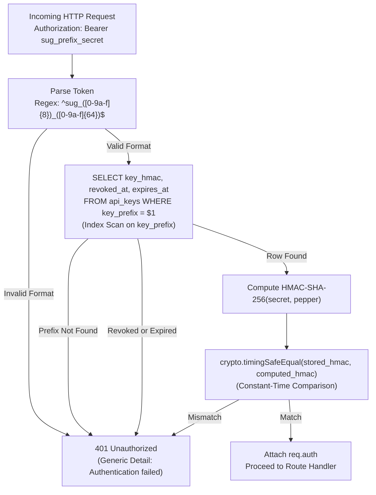

# Phase P6 — Application API Keys

## 1. Executive Summary

Phase P6 implements the production-grade API key authentication and authorization layer for the Secure Upload Gateway (SUG). It establishes cryptographically strong application identity verification, one-way peppered storage, constant-time verification, zero-information-leakage HTTP responses, and tamper-evident audit logging.

All key management and verification behaviors strictly adhere to the frozen P0 architecture (`docs/adr/0001-architecture-and-trust-zones.md`), the P3 database schema (`api_keys`), and the P4 configuration and pepper system (`config.secrets.pepper`).

---

## 2. API Key Format & Entropy Specification

### Key Structure

Every API key generated by the gateway adheres to a deterministic, human-inspectable format:

$$\text{Format: } \texttt{sug\_}\langle\text{key\_prefix}\rangle\texttt{\_}\langle\text{secret}\rangle$$

| Component           | Length   | Character Set        | Encoding                 | Entropy  | Purpose                                              |
| :------------------ | :------- | :------------------- | :----------------------- | :------- | :--------------------------------------------------- |
| **Type Identifier** | 4 chars  | `sug_`               | ASCII literal            | 0 bits   | Universal scanner/secret detector regex anchor       |
| **Key Prefix**      | 8 chars  | Hex (`[0-9a-f]{8}`)  | Lowercase Hex (4 bytes)  | 32 bits  | Fast, indexed database lookup without scanning table |
| **Secret**          | 64 chars | Hex (`[0-9a-f]{64}`) | Lowercase Hex (32 bytes) | 256 bits | CSPRNG authentication secret                         |
| **Total**           | 77 chars | ASCII                | —                        | 256 bits | Full bearer token                                    |

### Cryptographic Randomness

- **Entropy Source**: `crypto.randomBytes(32)` via Node.js CSPRNG, providing a full 256 bits of cryptographic entropy for the secret and 32 bits for the prefix (`crypto.randomBytes(4)`).
- **Collision Resistance**: Uniqueness of `key_prefix` is enforced at the database level by a `UNIQUE` index on `api_keys(key_prefix)`.
- **Parsing Invariants**: Validated via strict regex `^sug_([0-9a-f]{8})_([0-9a-f]{64})$`. Any key deviating from this format is rejected before database query execution.

---

## 3. Cryptographic Storage & Pepper Architecture

### One-Way HMAC-SHA-256 Storage

Raw API keys and secrets are **never** stored in the database, caches, logs, or disk:

1. **Storage Algorithm**: `HMAC-SHA-256(secret, pepper)`
2. **Column**: `api_keys.key_hmac bytea(32)`
3. **Application Pepper**: Loaded from `config.secrets.pepper` (configured in P4 from `/run/secrets/application_pepper` or environment).
4. **Avalanche Protection**: Even if an attacker obtains a full database dump of the `api_keys` table:
   - They cannot reverse the 32-byte binary HMAC without the secret and pepper.
   - Offline rainbow table attacks are rendered infeasible due to the 256-bit secret entropy and external pepper.
5. **Single Emission**: The raw secret is returned to the provisioning caller exactly once upon creation. It is never recoverable thereafter.

---

## 4. Verification Pipeline & Timing Attack Mitigation

### Two-Step Constant-Time Verification

Authentication occurs via a two-stage lookup to guarantee optimal performance while eliminating timing side-channels:



### Constant-Time Comparison Invariants

- Implemented in [`services/api/src/auth/keys.ts`](file:///c:/Users/ACER/Desktop/CLOUD_SECURITY_PROJECT/services/api/src/auth/keys.ts):
  ```ts
  export function constantTimeCompare(a: Buffer, b: Buffer): boolean {
    if (a.length !== 32 || b.length !== 32) {
      return false;
    }
    return crypto.timingSafeEqual(a, b);
  }
  ```
- Protects against Node's `RangeError` when buffer lengths differ by checking length beforehand without leaking byte comparison timing.
- Both inputs to `timingSafeEqual` are guaranteed to be 32-byte SHA-256 digests.

---

## 5. Fastify Authentication Middleware & HTTP Behavior

### Middleware Specification (`authenticateApiKey`)

- Registered as a Fastify `preHandler` hook.
- Enforces HTTP `Authorization: Bearer <TOKEN>` extraction.
- **Scope Enforcement**: Optionally accepts `requiredScopes?: string[]`. If the authenticated key lacks the required scope, a standardized `403 Forbidden` (`urn:sug:error:forbidden`) Problem Details response is issued.
- **Request Context**: Upon successful verification, attaches non-sensitive authentication context to `request.auth`:
  ```ts
  interface AuthenticatedApplication {
    applicationId: string;
    apiKeyId: string;
    keyPrefix: string;
    scopes: string[];
  }
  ```

### HTTP Threat Model & Edge Defenses

1. **Header Smuggling / Ambiguity Defense**:
   - Rejects duplicate `Authorization` headers (both array format and comma-separated concatenations synthesized by Node's HTTP parser).
   - Prevents header spoofing attacks where proxies and gateways might parse conflicting headers differently.
2. **CRLF & Header Injection Defense**:
   - Rejects headers containing newlines (`\r`, `\n`) or tab characters before parsing.
3. **Oversized Header Handling**:
   - Keys longer than 128 characters are rejected without crash, buffer overflow, or ReDoS.
4. **Unicode & Confusable Defense**:
   - Rejects non-hex or multi-byte UTF-8 sequences. Hex parser strictly accepts `[0-9a-f]`.
5. **Credential Redaction in Logs**:
   - Fastify logger is configured with strict redaction paths:
     `['req.headers.authorization', 'headers.authorization']`.
   - Raw bearer tokens are never emitted into stdout, debug logs, or error traces.

---

## 6. Zero-Leakage Problem Details Error Model

All authentication failures return RFC 7807 / RFC 9457 compliant error payloads with zero information oracle:

```json
{
  "type": "urn:sug:error:unauthorized",
  "title": "Unauthorized",
  "status": 401,
  "detail": "Authentication failed",
  "instance": "/api/v1/auth/probe",
  "requestId": "018f3a5e-7a42-7000-8000-000000000001"
}
```

### Zero-Oracle Guarantee

The HTTP response status (`401`) and detail message (`"Authentication failed"`) are identical across all failure modes:

- Key prefix not in database
- Key secret HMAC mismatch
- Key expired
- Key revoked

An attacker cannot determine whether a given prefix exists in the database, nor whether a key is expired vs. revoked vs. fraudulent.

---

## 7. Tamper-Evident Audit Logging Policy

Authentication events are committed to the tamper-evident hash-chained audit ledger (`audit_events`) via the PostgreSQL function `audit_append()`:

| Action                 | Actor Type | Actor ID                    | References (`p_refs`)                            | Details (`p_details`)    |
| :--------------------- | :--------- | :-------------------------- | :----------------------------------------------- | :----------------------- |
| `api_key.created`      | `user`     | User UUID                   | `{ application_id, api_key_id }`                 | `{ key_prefix, scopes }` |
| `api_key.auth_success` | `api_key`  | API Key UUID                | `{ application_id, api_key_id, request_id, ip }` | `{ key_prefix }`         |
| `api_key.auth_failure` | `api_key`  | API Key UUID or `'unknown'` | `{ application_id, api_key_id, request_id, ip }` | `{ reason, key_prefix }` |
| `api_key.revoked`      | `user`     | Revoker UUID or `'system'`  | `{ application_id, api_key_id }`                 | `{ key_prefix }`         |

### Audit Security Invariants

- **Zero Secrets**: Neither `rawKey` nor `secret` is ever recorded in `p_details`, `p_refs`, or any audit table column.
- **Fail-Safe Logging**: Audit emission during authentication is wrapped to ensure that transient database logging latency does not crash the HTTP connection while preserving fail-closed security.

---

## 8. Least-Privilege Database Role Separation

Database permissions strictly follow the frozen P3 security architecture:

| Role                           | `api_keys` Table Permissions | `audit_append` Execution | Justification                                                                  |
| :----------------------------- | :--------------------------- | :----------------------- | :----------------------------------------------------------------------------- |
| `sug_api`                      | `SELECT` only                | `EXECUTE`                | Verifies key HMACs and records auth audit events. Cannot write or delete keys. |
| `sug_admin`                    | `SELECT`, `INSERT`, `UPDATE` | `EXECUTE`                | Provisions and revokes keys during domain administrative workflows.            |
| `sug_scanner` / `sug_promoter` | None                         | None                     | Scanners and promoters have zero access to client authentication credentials.  |

---

## 9. Verification Route & OpenAPI 3.0 Documentation

### Endpoint: `GET /api/v1/auth/probe`

- **Purpose**: Authenticated probe endpoint allowing client applications and health tooling to verify credential validity and inspect non-sensitive application identity.
- **Security Scheme**: `ApiKeyAuth` (HTTP Bearer format).
- **Responses**:
  - `200 OK`: Credential is valid.
    ```json
    {
      "status": "authenticated",
      "applicationId": "018f3a5e-7a42-7000-8000-000000000001",
      "keyPrefix": "a1b2c3d4",
      "scopes": ["upload:create", "upload:read"]
    }
    ```
  - `401 Unauthorized`: Missing, invalid, expired, or revoked API key (`urn:sug:error:unauthorized`).
  - `403 Forbidden`: Insufficient scopes (`urn:sug:error:forbidden`).
- **OpenAPI Schema**: Formally exported to [`docs/openapi.json`](file:///c:/Users/ACER/Desktop/CLOUD_SECURITY_PROJECT/docs/openapi.json).

---

## 10. Phase Boundary & Non-Goals

Phase P6 strictly implements Application API Keys. The following capabilities belong to future phases and are intentionally **NOT** implemented:

- **P7 Non-Goals**: No file upload sessions, presigned URLs, direct S3 upload tokens, or chunked upload APIs.
- **P8 Non-Goals**: No antivirus scanning engines, ClamAV, YARA rules, or ICAP integrations.
- **P9 Non-Goals**: No file promotion pipelines, quarantine release, or clean bucket movement.
- **Future Auth Non-Goals**: No JWT access tokens, no OAuth2 flows, no interactive user login endpoints, and no public unauthenticated application registration endpoints. Application registration is kept at the domain/service level.
