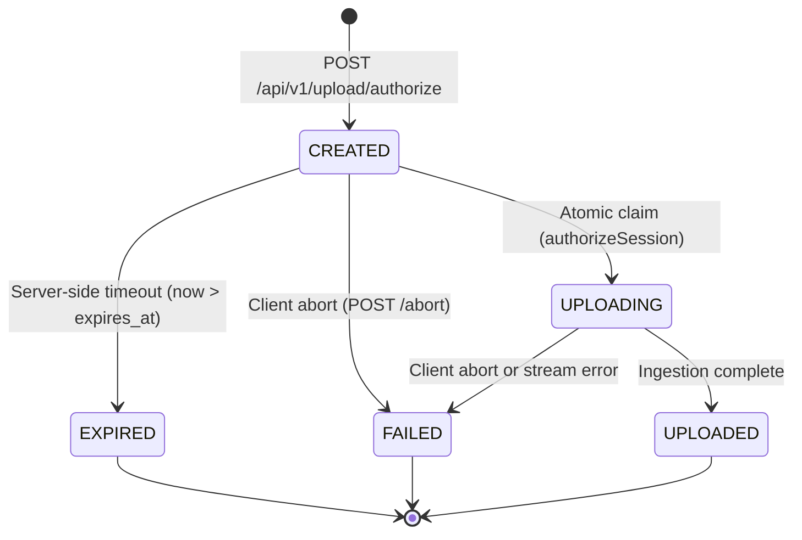

# Phase P7 — Upload Authorization Foundation & Tenant Isolation

## 1. Executive Summary

Phase P7 establishes the **Upload Authorization Foundation** for the Secure Upload Gateway (SUG).
It builds directly upon the authenticated application identity established in Phase P6, creating the strict authorization, tenant isolation, and session reservation boundary required before streaming ingestion and multi-engine inspection are introduced in subsequent phases.

Phase P7 guarantees that:

1. Every upload session is strictly bound to the authenticated application (`request.auth.applicationId`).
2. Client-provided application IDs, arbitrary headers, or query parameters can never override or spoof authenticated identity.
3. Cross-application resource access is impossible: applications can only query, claim, or abort their own upload sessions.
4. Storage keys are generated by the server (`incoming/<app_id>/<upload_id>`), completely decoupled from untrusted client filenames.
5. Upload session state transitions are protected by atomic optimistic locking in PostgreSQL 18, eliminating concurrent double-claim race conditions.
6. All session lifecycle events are recorded in the tamper-evident hash-chained audit ledger (`audit_events`) with zero credentials or secrets.

---

## 2. Architectural Positioning in Pipeline Topology

```
+-----------------------------------------------------------------------------------+
| Z1 Untrusted Client / External Application                                        |
+-----------------------------------------------------------------------------------+
                                         │  Authorization: Bearer sug_<prefix>_<secret>
                                         ▼
+-----------------------------------------------------------------------------------+
| Z2 Edge API Gateway (services/api)                                                |
|                                                                                   |
|  [ Phase P6 Authentication Hook ]                                                 |
|    - Validates HMAC-SHA-256 in constant time                                      |
|    - Attaches req.auth = { applicationId, apiKeyId, keyPrefix, scopes }           |
|                                                                                   |
|  [ Phase P7 Upload Authorization Boundary ]                                       |
|    - requireScope('upload')                                                       |
|    - enforceApplicationOwnership() (prevents tenant spoofing)                     |
|    - Bounded server-side duration (60s – 900s, default 600s)                      |
|    - Validates declared size <= min(declaredSize, policy.maxFileSize)             |
|    - Generates immutable key: incoming/<app_id>/<upload_id>                       |
|    - Reserves session in PostgreSQL (status = 'CREATED')                          |
|    - Emits audit_append('upload_session.created')                                 |
+-----------------------------------------------------------------------------------+
                                         │
                                         ▼
                       [ Future Phase P8: Policy Engine ]
                       [ Future Phase P10: Streaming Ingestion ]
```

---

## 3. Tenant Isolation & Ownership Enforcement

### Anti-Spoofing Middleware (`enforceApplicationOwnership`)

Located in [`services/api/src/auth/tenant.ts`](file:///c:/Users/ACER/Desktop/CLOUD_SECURITY_PROJECT/services/api/src/auth/tenant.ts):

- Inspects incoming requests for client-supplied application identifiers across:
  - Route parameters (`params.applicationId`, `params.appId`)
  - Query parameters (`query.applicationId`)
  - Request body (`body.applicationId`)
- If a client supplies an application ID that does not match `req.auth.applicationId`:
  - Request is halted immediately.
  - An RFC 7807/9457 `403 Forbidden` (`urn:sug:error:forbidden`) Problem Details response is returned:
    `"Access denied: client application ID does not match authenticated credential context"`
- Guarantees that callers cannot manipulate tenant routing by tampering with payload fields while authenticating with a valid key from a different tenant.

### Scoped Database Operations

Every database query retrieving, claiming, updating, or aborting upload sessions strictly enforces tenant scoping at the SQL level:

```sql
SELECT * FROM upload_sessions
WHERE id = $1 AND application_id = $2
```

- If an attacker attempts to query or mutate another tenant's `sessionId`, the query returns zero rows.
- The API responds with an identical generic `404 Not Found` Problem Details payload, preventing resource-enumeration and ownership oracles.

---

## 4. Object Key Security & Filename Normalization

### Immutable Quarantine Object Keys

- Implemented in [`services/api/src/auth/session-utils.ts`](file:///c:/Users/ACER/Desktop/CLOUD_SECURITY_PROJECT/services/api/src/auth/session-utils.ts):
  $$\text{Key Pattern: } \texttt{incoming/}\langle\text{application\_id}\rangle\texttt{/}\langle\text{upload\_id}\rangle$$
- **Rules & Invariants**:
  1. `application_id` and `upload_id` MUST be valid UUIDs (`uuidv7()` or `uuidv4()`).
  2. Untrusted client-supplied filenames are **NEVER** incorporated into cloud storage keys or filesystem paths.
  3. Eliminates directory traversal (`../`, `..\`), null-byte poisoning (`\x00`), and control character injection.

### Filename Metadata Sanitization

- Client-supplied `original_filename` is preserved purely as descriptive metadata in PostgreSQL:
  - Path components (both POSIX `/` and Windows `\`) are stripped to retain only the base filename.
  - Null bytes (`\x00`) and control characters (`[\x00-\x1F\x7F]`) are stripped.
  - Multiple consecutive dots (`...`) are collapsed.
  - Maximum length is clamped to 255 bytes while preserving the original extension.

---

## 5. Upload Session Lifecycle & Concurrency Model

### State Machine



### Optimistic Concurrency & Race-Condition Defense

Upload session claims execute via atomic conditional updates in PostgreSQL:

```sql
UPDATE upload_sessions
SET status = 'UPLOADING'
WHERE id = $1 AND application_id = $2 AND status = 'CREATED' AND expires_at > now()
RETURNING *
```

- **Single-Use Invariant**: Only one concurrent request can transition a session from `CREATED` to `UPLOADING`.
- **Duplicate Claim Protection**: A second concurrent attempt on the same session returns 0 rows and is rejected with `ALREADY_CLAIMED`.
- **Expired Claim Protection**: If `now() >= expires_at`, the update returns 0 rows and transitions the session to `EXPIRED`.

---

## 6. Time, Expiration & Bounded Resource Budgets

1. **Server-Side UTC Time**: Expiration is calculated and evaluated exclusively on the server (`clock_timestamp()` / `now()`). Client timestamps are never trusted.
2. **Bounded Lifespan**:
   - Minimum session lifespan: 60 seconds (`MIN_SESSION_DURATION_SECONDS`).
   - Default session lifespan: 600 seconds (10 minutes, `DEFAULT_SESSION_DURATION_SECONDS`).
   - Maximum session lifespan: 900 seconds (15 minutes, `MAX_SESSION_DURATION_SECONDS`).
3. **Payload Size Ceilings**:
   - Global maximum: 52,428,800 bytes (50 MB, `MAX_UPLOAD_FILE_SIZE`).
   - Policy-enforced maximum: `min(declaredSize, policy.maxFileSize)`.
   - Attempts to reserve sessions exceeding these limits are rejected with HTTP 400 Validation Error before database insertion.

---

## 7. Tamper-Evident Audit Logging Integration

All upload authorization state transitions append immutable evidence rows to `audit_events` via PostgreSQL's `audit_append()`:

| Action                        | Actor Type | Actor ID      | Scoped References (`p_refs`)     | Details (`p_details`)                                                        |
| :---------------------------- | :--------- | :------------ | :------------------------------- | :--------------------------------------------------------------------------- |
| `upload_session.created`      | `api_key`  | API Key UUID  | `{ application_id, request_id }` | `{ session_id, original_filename, declared_size, declared_mime, policy_id }` |
| `upload_session.authorized`   | `api_key`  | API Key UUID  | `{ application_id, request_id }` | `{ session_id }`                                                             |
| `upload_session.claim_failed` | `service`  | `api_gateway` | `{ application_id, request_id }` | `{ session_id, reason }`                                                     |
| `upload_session.completed`    | `api_key`  | API Key UUID  | `{ application_id, request_id }` | `{ session_id }`                                                             |
| `upload_session.aborted`      | `api_key`  | API Key UUID  | `{ application_id, request_id }` | `{ session_id, reason }`                                                     |
| `upload_session.expired`      | `service`  | `api_gateway` | `{ application_id }`             | `{ session_id }`                                                             |

- **Zero-Secret Invariant**: API key secrets, authorization headers, and signed tokens are never recorded in audit logs.
- **Fail-Safe Robustness**: `request_id` values are validated as UUIDs before casting to prevent database query errors on malformed correlation IDs.

---

## 8. Database Role & Privilege Boundaries

Phase P7 operates strictly within the least-privilege role boundaries established in Phase P3:

| Database Role      | Operations on `upload_sessions` | Operations on `security_policies` | `audit_append()` |
| :----------------- | :------------------------------ | :-------------------------------- | :--------------- |
| **`sug_api`**      | `SELECT`, `INSERT`, `UPDATE`    | `SELECT` only                     | `EXECUTE`        |
| **`sug_scanner`**  | `SELECT` only                   | `SELECT` only                     | `EXECUTE`        |
| **`sug_promoter`** | `SELECT` only                   | `SELECT` only                     | `EXECUTE`        |
| **`sug_admin`**    | `ALL`                           | `ALL`                             | `EXECUTE`        |

- `sug_api` has zero permissions to alter security policies, insert security decisions, or delete audit logs.
- Zero new migrations were required: `pgmigrations` count remains exactly 9, preserving frozen invariant test `DB-01`.

---

## 9. API Routes & OpenAPI 3.0 Documentation

### Endpoints

1. `POST /api/v1/upload/authorize`
   - Header: `Authorization: Bearer <API_KEY>`
   - Body: `{ filename, declaredSize, declaredMime, policyId?, declaredSha256?, clientRef?, durationSeconds? }`
   - Response: `201 Created` with reserved session metadata and canonical `quarantineKey`.
2. `GET /api/v1/upload/sessions/:id`
   - Header: `Authorization: Bearer <API_KEY>`
   - Response: `200 OK` with session details (strictly scoped to caller's `applicationId`), or `404 Not Found`.
3. `POST /api/v1/upload/sessions/:id/abort`
   - Header: `Authorization: Bearer <API_KEY>`
   - Response: `200 OK` (`{ status: "FAILED", sessionId }`), or `404 Not Found`.

All routes are fully documented in [`docs/openapi.json`](file:///c:/Users/ACER/Desktop/CLOUD_SECURITY_PROJECT/docs/openapi.json).

---

## 10. Explicit Phase Boundaries & P8+ Non-Goals

Phase P7 establishes only the upload authorization and tenant foundation. The following capabilities are explicitly **NOT** implemented in P7:

- **P8 Non-Goals**: No policy engine compilation, rule parsing, or custom preset evaluation.
- **P9 Non-Goals**: No direct S3 storage provider instantiation or quarantine bucket PutObject calls.
- **P10 Non-Goals**: No HTTP body streaming, zero-buffering tee hashing, or socket byte counters.
- **P14–P17 Non-Goals**: No ClamAV INSTREAM scanning, YARA-X rules, or archive extraction.
- **P19–P20 Non-Goals**: No AES-256-GCM encryption, clean storage promotion, or release decisions.
